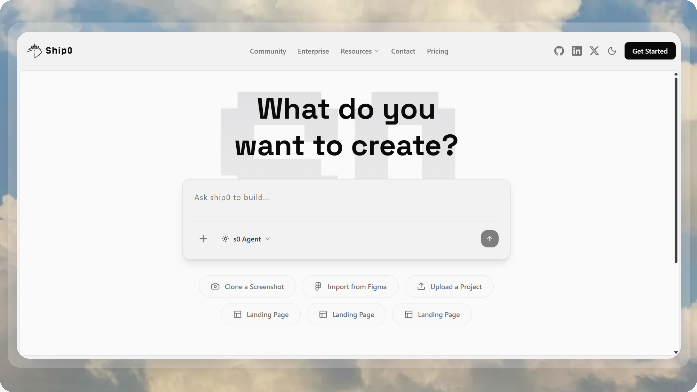

# Ship0

## Overview

**Ship0** is an AI-powered code generation platform that enables developers to quickly create and ship projects through an intelligent chat interface. Describe what you want to build in natural language, and Ship0's AI agents will generate complete project structures, execute code in secure sandboxed environments, and provide live previews—all in real-time.

## Features

- **AI-Powered Code Generation** - Generate complete projects through conversational AI
- **Real-Time Code Execution** - Secure E2B sandboxed environments for instant code execution
- **Interactive Chat Interface** - Build and iterate on projects conversationally
- **Live Preview** - View generated code and running applications in real-time
- **Project Management** - Create, organize, and manage multiple projects
- **Secure Authentication** - Clerk-based user authentication and management

## Tech Stack

### Frontend

- Next.js 16 with React 19 and TypeScript
- Tailwind CSS 4 with Radix UI and shadcn/ui components
- TanStack Query for state management
- Clerk for authentication

### Backend

- Bun runtime with Express.js and TypeScript
- PostgreSQL with Prisma ORM
- Inngest for AI workflow orchestration
- E2B Code Interpreter for sandboxed execution

---

For detailed setup instructions and architecture documentation, see the individual README files in the `frontend/` and `backend/` directories.
