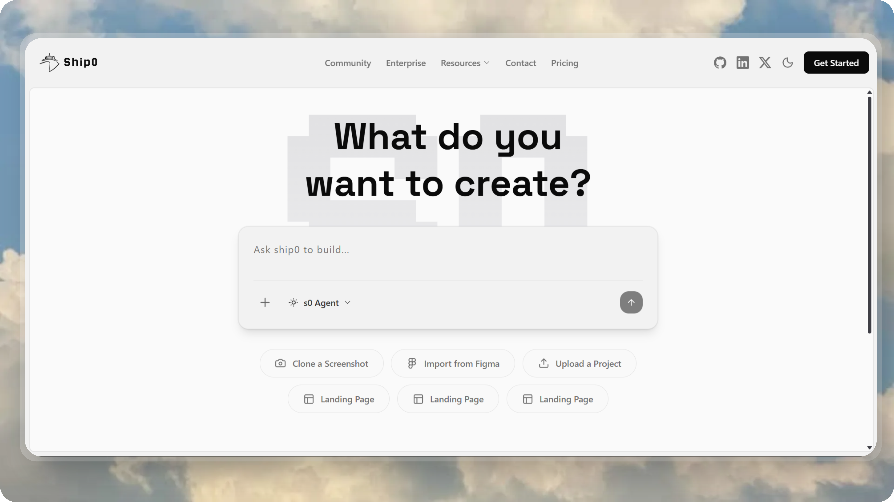

# Ship0



## 🚀 Overview

**Ship0** is a AI-powered code generation platform that enables developers to quickly create and ship projects through an intelligent chat interface. Built with cutting-edge technologies, Ship0 combines the power of AI agents with real-time code execution in sandboxed environments.

## ✨ Key Features

- **AI-Powered Code Generation**: Leverage AI agents (via Inngest Agent Kit) to generate complete project structures and code
- **Real-Time Code Execution**: Execute code in secure E2B sandboxed environments
- **Interactive Chat Interface**: Communicate with AI to build and modify projects conversationally
- **Live Preview**: View generated code and preview running applications in real-time
- **Project Management**: Create, organize, and manage multiple projects with ease
- **Secure Authentication**: Clerk-based authentication for secure user management
- **Resizable Panels**: Customizable workspace with draggable panels for optimal workflow

## 🛠️ Tech Stack

### Frontend

- **Framework**: [Next.js 16](https://nextjs.org/) with React 19
- **Language**: TypeScript
- **Styling**: Tailwind CSS 4 with custom animations
- **UI Components**:
  - Radix UI primitives (Dropdown, Tooltip, Collapsible, etc.)
  - shadcn/ui components
  - Lucide React icons & Phosphor Icons
- **State Management**:
  - TanStack Query (React Query) for server state
  - React Hook Form with Zod validation
- **Authentication**: Clerk
- **Animations**: Framer Motion (motion)
- **Code Highlighting**: Prism.js
- **Layout**: React Resizable Panels

### Backend

- **Runtime**: [Bun](https://bun.sh/)
- **Framework**: Express.js
- **Language**: TypeScript
- **Database**: PostgreSQL with Prisma ORM
- **Authentication**: Clerk Express
- **AI/Agents**:
  - [Inngest](https://www.inngest.com/) for workflow orchestration
  - Inngest Agent Kit for AI agent capabilities
- **Code Execution**: E2B Code Interpreter for sandboxed execution
- **API**: RESTful API with CORS support

### Database Schema

- **Users**: Clerk-integrated user management
- **Projects**: User-owned projects with unique IDs
- **Messages**: Chat messages with role-based system (USER/ASSISTANT)
- **Fragments**: Code snippets with sandbox URLs and file structures

## 📁 Project Structure

```
Ship0/
├── .github/                 # GitHub repository assets
│   └── project-thumbnail.png
│
├── frontend/                # Next.js frontend application
│   ├── src/
│   │   ├── app/             # Next.js app router pages
│   │   │   ├── page.tsx     # Landing page with Hero & Projects
│   │   │   ├── chat/[projectId]/  # Chat interface for projects
│   │   │   └── sign-in/     # Authentication pages
│   │   ├── components/      # React components
│   │   │   ├── home/        # Landing page components
│   │   │   ├── chat-panel/  # Chat interface components
│   │   │   ├── preview-panel/ # Code preview & execution
│   │   │   ├── common/      # Shared components (Footer, etc.)
│   │   │   └── ui/          # UI primitives (shadcn/ui)
│   │   ├── contexts/        # React contexts
│   │   └── assests/         # Static assets (logo, fonts)
│   └── package.json
│
└── backend/                 # Bun + Express backend
    ├── src/
    │   ├── index.ts         # Express server entry point
    │   ├── routes/          # API routes
    │   │   ├── clerk-webhook.ts
    │   │   └── project-routes/
    │   ├── inngest/         # AI agent workflows
    │   │   ├── functions.ts
    │   │   ├── prompt.ts
    │   │   └── utils.ts
    │   └── lib/             # Utilities (Prisma client)
    ├── prisma/
    │   └── schema.prisma    # Database schema
    └── package.json
```

## 🔄 Application Flow

### 1. **User Authentication**

- Users sign in via Clerk authentication
- User data is synced to PostgreSQL via webhooks
- Authenticated users can create and manage projects

### 2. **Project Creation**

- Users create new projects from the landing page
- Projects are stored in PostgreSQL with unique IDs
- Each project has its own chat interface

### 3. **AI-Powered Development**

```
User Input → Chat Interface → Backend API → Inngest Agent
                                                 ↓
Live Preview ← E2B Sandbox ← Code Generation ← AI Agent
```

- Users describe what they want to build in natural language
- Messages are sent to the backend and processed by Inngest workflows
- AI agents generate code based on user requirements
- Code is executed in E2B sandboxed environments
- Results are streamed back to the frontend in real-time

### 4. **Code Preview & Iteration**

- Generated code appears in the preview panel
- Users can view file structures and code content
- Live preview shows the running application
- Users can iterate by sending follow-up messages
- All messages and fragments are persisted in the database

### 5. **Project Management**

- Users can view all their projects on the home page
- Each project maintains its conversation history
- Projects can be reopened to continue development
- Code fragments are linked to specific messages

## 🎨 UI Features

- **Dark Mode**: Built-in theme switching with next-themes
- **Responsive Design**: Mobile-first approach with Tailwind CSS
- **Smooth Animations**: Framer Motion for delightful interactions
- **Resizable Workspace**: Drag-and-drop panel resizing
- **Code Syntax Highlighting**: Prism.js for beautiful code display
- **Toast Notifications**: Sonner for elegant user feedback

## 🔐 Security

- Clerk handles all authentication and user management
- API routes are protected with `requireAuth()` middleware
- Code execution happens in isolated E2B sandboxes
- CORS configured for secure cross-origin requests
- Environment variables for sensitive credentials

## 📝 Database Models

- **User**: Clerk-synced user profiles
- **Project**: User-owned projects with timestamps
- **Message**: Chat messages with roles (USER/ASSISTANT) and types (RESULT/ERROR)
- **Fragment**: Code snippets with sandbox URLs and file structures (JSON)
