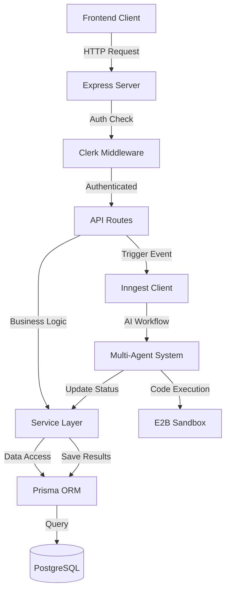
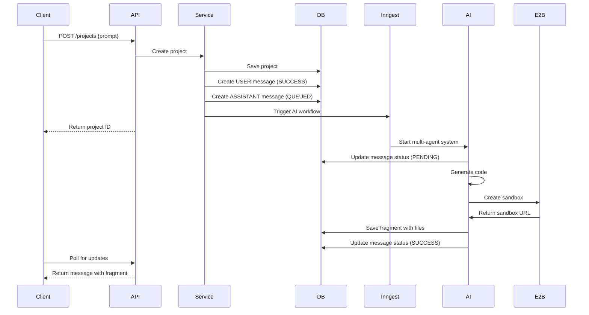
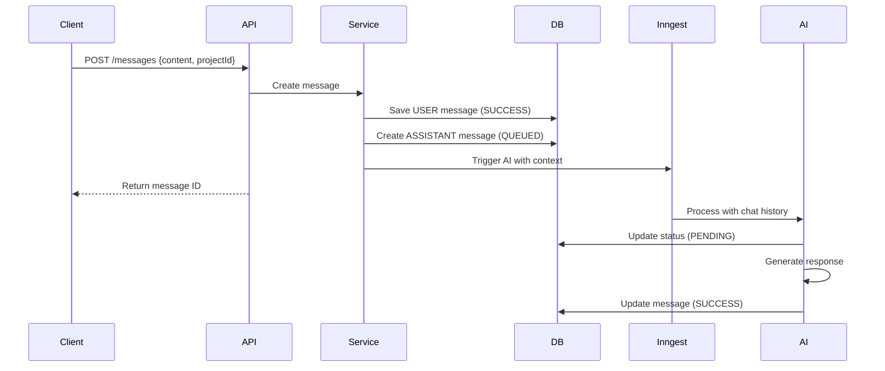
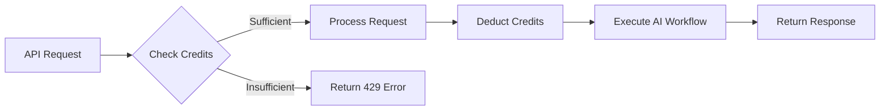

# 🚀 Ship0 Backend

> AI-powered code generation backend built with Bun, Express, and Inngest

Ship0 Backend is a API server that powers the Ship0 platform - an AI-driven code generation system. It leverages multi-agent AI workflows to generate, execute, and manage code projects in isolated sandboxes.

---

## ️ Tech Stack

### **Runtime & Framework**

- **[Bun](https://bun.sh)** - Fast all-in-one JavaScript runtime
- **[Express.js](https://expressjs.com/)** - Web application framework
- **[TypeScript](https://www.typescriptlang.org/)** - Type-safe JavaScript

### **Database & ORM**

- **[PostgreSQL](https://www.postgresql.org/)** - Primary database
- **[Prisma](https://www.prisma.io/)** - Next-generation ORM

### **AI & Agents**

- **[Inngest](https://www.inngest.com/)** - Durable workflow engine for AI agents
- **[@inngest/agent-kit](https://www.npmjs.com/package/@inngest/agent-kit)** - Multi-agent orchestration
- **[E2B Code Interpreter](https://e2b.dev/)** - Sandboxed code execution environment

### **Authentication & Security**

- **[Clerk](https://clerk.com/)** - User authentication and management
- **[Rate Limiter Flexible](https://github.com/animir/node-rate-limiter-flexible)** - Credit-based rate limiting

### **Validation & Code Quality**

- **[Zod](https://zod.dev/)** - TypeScript-first schema validation
- **[ESLint](https://eslint.org/)** - Code linting
- **[Prettier](https://prettier.io/)** - Code formatting

---

## ✨ Features

- 🤖 **Multi-Agent AI System** - Orchestrated AI agents for code generation and enhancement
- 🔐 **Clerk Authentication** - Secure user authentication with webhook support
- 💳 **Credit-Based Rate Limiting** - Subscription-tier based API usage control
- 🏖️ **Sandboxed Execution** - Isolated code execution using E2B sandboxes
- 📊 **Real-time Status Updates** - Message status tracking (QUEUED → PENDING → SUCCESS/FAILED)
- 🔄 **Durable Workflows** - Reliable AI agent execution with Inngest
- 🗃️ **PostgreSQL Database** - Robust data persistence with Prisma ORM
- 🎯 **Type-Safe APIs** - Full TypeScript support with Zod validation

---

## 🏗️ Architecture



### **Request Flow**

1. **Client Request** → Express server receives API request
2. **Authentication** → Clerk middleware validates user
3. **Rate Limiting** → Credit-based limiter checks usage quota
4. **Validation** → Zod schemas validate request payload
5. **Service Layer** → Business logic processes the request
6. **Database** → Prisma ORM interacts with PostgreSQL
7. **AI Workflow** → Inngest triggers multi-agent system
8. **Code Execution** → E2B sandbox runs generated code
9. **Response** → Results sent back to client

---

## 📁 Folder Structure

```
backend/
├── prisma/
│   └── schema.prisma              # Database schema definition
├── sandbox-templates/             # E2B sandbox configurations
│   └── nextjs/
│       └── e2b.Dockerfile        # Next.js sandbox template
├── src/
│   ├── index.ts                  # Application entry point
│   ├── inngest/
│   │   ├── functions.ts          # Inngest function definitions
│   │   ├── prompt.ts             # AI agent prompts
│   │   └── utils.ts              # Inngest utilities
│   ├── lib/
│   │   ├── prisma.ts             # Prisma client instance
│   │   └── rate-limiter-middleware.ts  # Rate limiting logic
│   ├── routes/
│   │   ├── clerk-webhook.ts      # Clerk webhook handler
│   │   ├── credits-route/
│   │   │   └── credit.ts         # Credit usage endpoints
│   │   ├── message-routes/
│   │   │   └── messages.ts       # Message CRUD endpoints
│   │   └── project-routes/
│   │       └── project.ts        # Project CRUD endpoints
│   ├── schemas/
│   │   ├── message-schema.ts     # Message validation schemas
│   │   └── project-schema.ts     # Project validation schemas
│   └── services/
│       ├── credit-service.ts     # Credit management logic
│       ├── message-service.ts    # Message business logic
│       └── project-service.ts    # Project business logic
├── .env                          # Environment variables
├── package.json                  # Dependencies and scripts
├── tsconfig.json                 # TypeScript configuration
└── README.md                     # This file
```

## 🔄 Application Flow

### **1. User Creates a Project**



### **2. User Sends a Message**



### **3. Credit-Based Rate Limiting**

